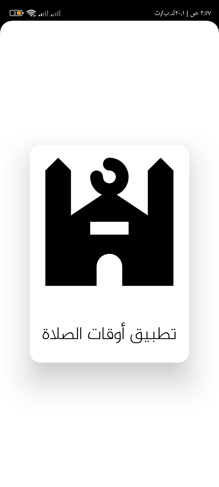
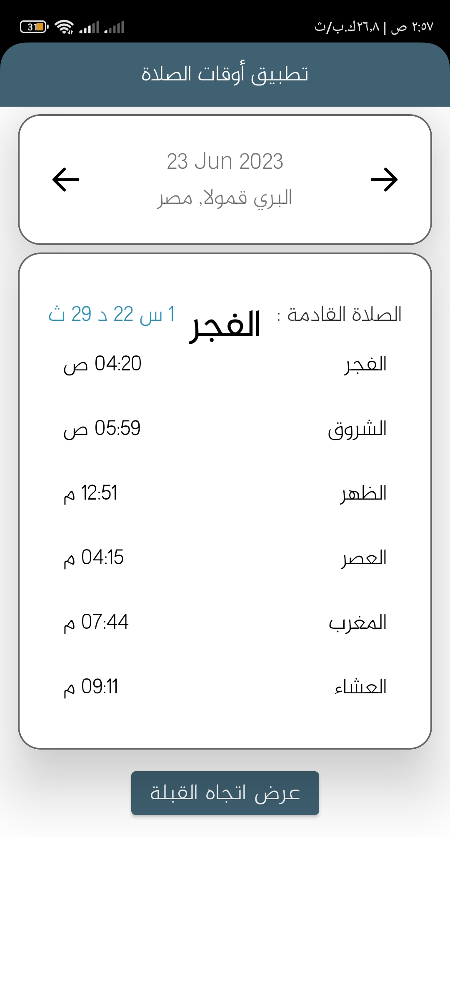
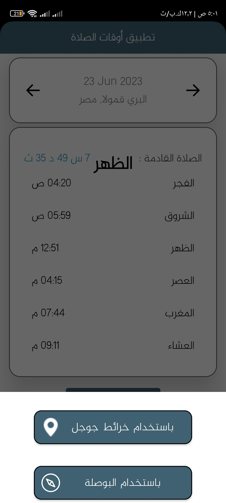

# MadarSoftTask
This is Task For Alalmiya alhura 

* Used in This Project
* Android Studio
* Clean Architecture and MVVM 
* Repository Pattern
* Retrofit
* Sensor Manager
* Data binding
* ROOM for local database caching
* Coroutines
* SharedPreferences

**Languages
*Kotlin and Java

**Images

#installing #App

.apk
<a href="https://raw.githubusercontent.com/AhmedMHassaan/PrayersTimesApp/master/APK/PeayerApp.apk" target="_blanc">Download<a/>
